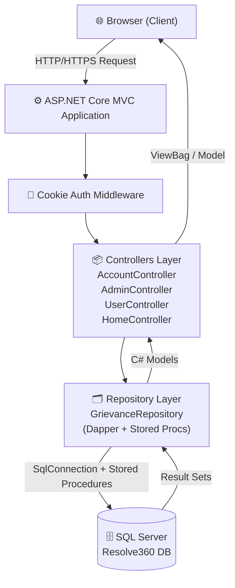
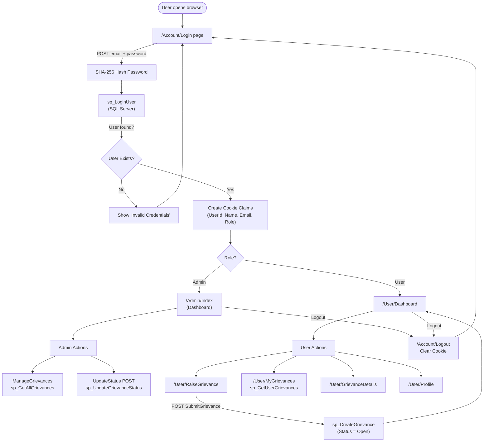
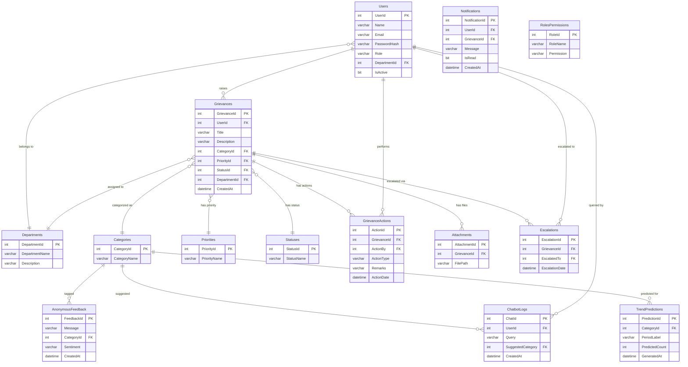
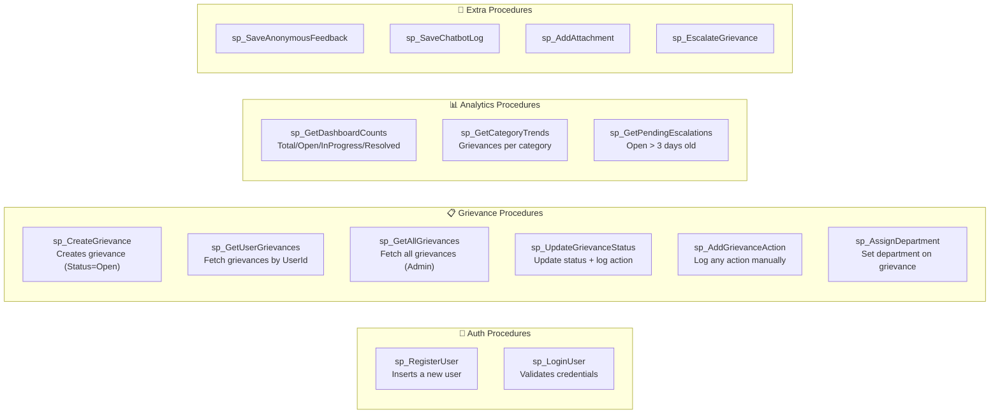
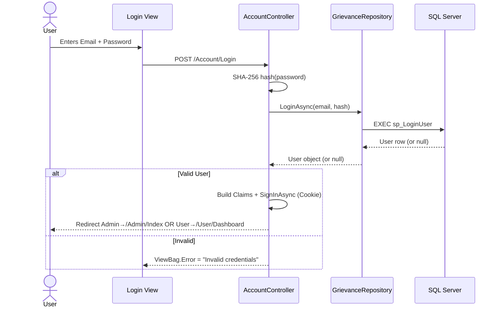
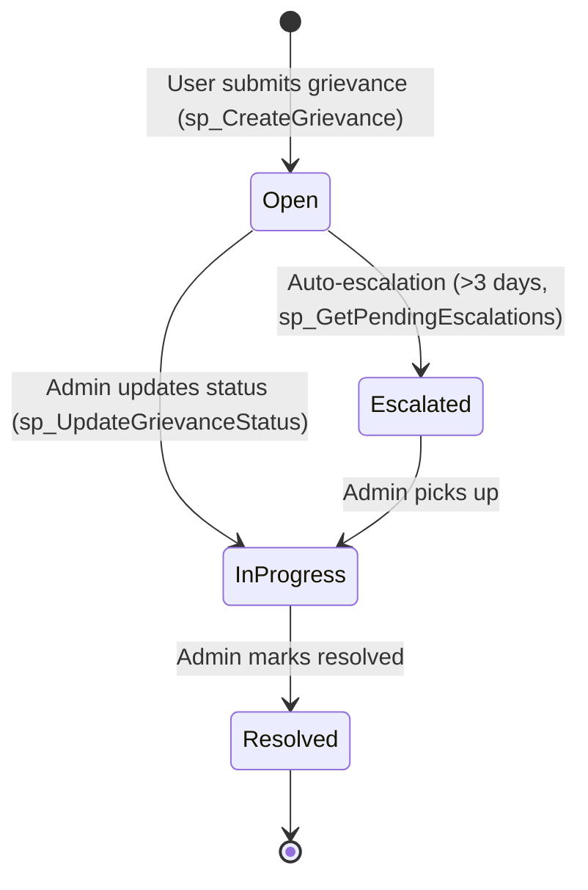
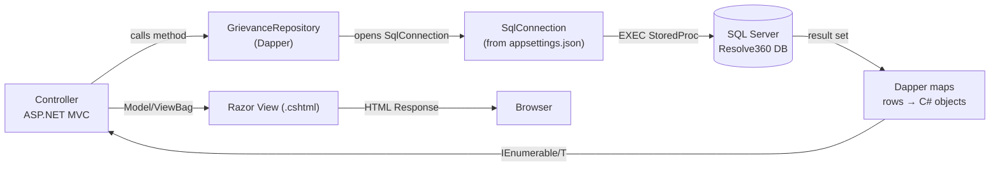

# Software Requirements Specification (SRS)
# Resolve360 — Grievance Redressal System

**Version:** 1.0  
**Date:** March 25, 2026  
**Technology Stack:** ASP.NET Core MVC, SQL Server, Dapper ORM  
**Database:** Resolve360 (SQL Server / SQL Express)

---

## Table of Contents

1. [Project Overview](#1-project-overview)
2. [System Architecture](#2-system-architecture)
3. [User Roles](#3-user-roles)
4. [Functional Requirements](#4-functional-requirements)
5. [System Flow (End-to-End)](#5-system-flow-end-to-end)
6. [Database System](#6-database-system)
7. [Stored Procedures](#7-stored-procedures)
8. [Module-Wise Flow](#8-module-wise-flow)
9. [Non-Functional Requirements](#9-non-functional-requirements)
10. [Project File Structure](#10-project-file-structure)

---

## 1. Project Overview

**Resolve360** is a web-based Grievance Redressal portal designed to allow users (students/employees) to submit grievances/complaints and allow administrators to manage, track, and resolve them efficiently.

| Property | Details |
|---|---|
| **Application Name** | Resolve360 |
| **Framework** | ASP.NET Core MVC (.NET 8+) |
| **Database** | Microsoft SQL Server (Express) |
| **ORM** | Dapper (micro-ORM) |
| **Authentication** | Cookie-based Authentication |
| **Authorization** | Role-based (Admin / User) |
| **Connection** | `Server=MANN\SQLEXPRESS;Database=Resolve360` |

---

## 2. System Architecture



> **Key Pattern:** The app follows the **Repository Pattern** — all database interactions are centralized in `GrievanceRepository.cs`, which calls SQL Server **Stored Procedures** via Dapper.

---

## 3. User Roles

| Role | Description | Access Level |
|---|---|---|
| **User** | General user (student/employee) | Can register, login, raise grievances, view own grievances, view profile |
| **Admin** | System administrator | Can login, view dashboard stats, manage ALL grievances, update grievance status |

> Role is stored in the `Users.Role` column and injected into **Claims** during login, enforced via `[Authorize(Roles = "Admin")]` and `[Authorize]` attributes.

---

## 4. Functional Requirements

### FR-01: User Registration
- Users can self-register with Name, Email, Password, and Role
- Password is hashed using **SHA-256** before storage
- Calls stored procedure `sp_RegisterUser`

### FR-02: User Login
- Users authenticate with Email + Password (SHA-256 hashed)
- On success: Cookie session is created with Claims (UserId, Name, Email, Role)
- Admin users → redirected to `/Admin/Index`
- Regular users → redirected to `/User/Dashboard`
- Calls stored procedure `sp_LoginUser`

### FR-03: Logout
- Clears authentication cookie and redirects to Login page

### FR-04: Raise a Grievance (User)
- Authenticated users can submit a grievance with:
  - **Title** (complaint subject)
  - **Description** (detailed description)
  - **Category** (Technical Issue, Hostel/Facility, Academic Query, Other)
  - **Priority** (Low=1, Medium=2, High=3)
  - **Department** (IT Support, Administration, Finance)
- Grievance is created with default `StatusId = 1` (Open)
- Calls `sp_CreateGrievance`

### FR-05: View My Grievances (User)
- User can see all grievances they have raised
- Calls `sp_GetUserGrievances` with their UserId

### FR-06: View Grievance Details (User)
- User can click on a grievance to see full details

### FR-07: User Dashboard
- Shows a summary of user's own grievances on login

### FR-08: Admin Dashboard
- Shows aggregate counts: Total, Open, In Progress, Resolved
- Calls `sp_GetDashboardCounts`

### FR-09: Admin Manage Grievances
- Admin views ALL grievances from all users
- Shows per-status counts in the UI (New, In Progress, Resolved)
- Calls `sp_GetAllGrievances`

### FR-10: Admin Update Grievance Status
- Admin can change any grievance's status (Open → In Progress → Resolved)
- Action is logged in `GrievanceActions` table with remark and admin's UserId
- Calls `sp_UpdateGrievanceStatus`

---

## 5. System Flow (End-to-End)



---

## 6. Database System

### 6.1 Database Schema Overview



### 6.2 Table Descriptions

| Table | Purpose | Key Columns |
|---|---|---|
| `Users` | Stores all registered users (Admin + User) | UserId, Name, Email, PasswordHash, Role |
| `Departments` | Department master data | DepartmentId, DepartmentName |
| `Categories` | Grievance type categories | CategoryId, CategoryName |
| `Priorities` | Priority levels (Low/Medium/High) | PriorityId, PriorityName |
| `Statuses` | Grievance lifecycle states | StatusId, StatusName |
| `Grievances` | Core grievance records | GrievanceId, UserId, Title, Description, CategoryId, PriorityId, StatusId, DepartmentId |
| `GrievanceActions` | Audit log of all status changes/actions | ActionId, GrievanceId, ActionBy, ActionType, Remarks |
| `Notifications` | In-app notifications for users | NotificationId, UserId, GrievanceId, Message, IsRead |
| `AnonymousFeedback` | Feedback submitted without login | FeedbackId, Message, Sentiment |
| `ChatbotLogs` | Chatbot query history | ChatId, UserId, Query, SuggestedCategory |
| `TrendPredictions` | ML/analytics trend data | PredictionId, CategoryId, PredictedCount |
| `Attachments` | Files attached to grievances | AttachmentId, GrievanceId, FilePath |
| `RolesPermissions` | Permission matrix for roles | RoleId, RoleName, Permission |
| `Escalations` | Escalation tracking | EscalationId, GrievanceId, EscalatedTo |

### 6.3 Seed Data

| Table | Seeded Values |
|---|---|
| `Categories` | Technical Issue, Hostel/Facility, Academic Query, Other |
| `Departments` | IT Support, Administration, Finance |
| `Priorities` | Low (1), Medium (2), High (3) |
| `Statuses` | Open (1), In Progress (2), Resolved (3) |

---

## 7. Stored Procedures



| Stored Procedure | Used By | What It Does |
|---|---|---|
| `sp_RegisterUser` | AccountController | Inserts new user into Users table |
| `sp_LoginUser` | AccountController | Fetches user by email + password hash (IsActive=1) |
| `sp_CreateGrievance` | UserController | Creates grievance with StatusId=1 (Open) |
| `sp_GetUserGrievances` | UserController | Returns all grievances for a given UserId |
| `sp_GetAllGrievances` | AdminController | Returns all grievances in the system |
| `sp_UpdateGrievanceStatus` | AdminController | Updates status AND logs in GrievanceActions |
| `sp_AddGrievanceAction` | *(future use)* | Logs an action manually |
| `sp_AssignDepartment` | *(future use)* | Reassigns department on a grievance |
| `sp_GetDashboardCounts` | AdminController | Returns aggregate counts for admin dashboard |
| `sp_GetCategoryTrends` | *(future use)* | Group by category for analytics |
| `sp_GetPendingEscalations` | *(future use)* | Returns open grievances older than 3 days |
| `sp_SaveAnonymousFeedback` | *(future use)* | Stores anonymous feedback |
| `sp_SaveChatbotLog` | *(future use)* | Stores chatbot queries |
| `sp_AddAttachment` | *(future use)* | Attaches a file by path |
| `sp_EscalateGrievance` | *(future use)* | Creates escalation record |

---

## 8. Module-Wise Flow

### 8.1 Authentication Module



### 8.2 Grievance Lifecycle



### 8.3 Repository Data Flow



---

## 9. Non-Functional Requirements

| Requirement | Details |
|---|---|
| **Security** | Passwords hashed with SHA-256; Cookie-based auth with HTTPS redirection; Role-based access control via `[Authorize]` |
| **Performance** | All DB calls use async/await; Dapper is lightweight (no EF overhead) |
| **Maintainability** | Repository pattern separates DB logic from controllers; stored procedures keep SQL out of C# |
| **Scalability** | Database has tables for Notifications, Chatbot, Trends, Escalations — ready for future features |
| **Reliability** | Default values on key columns (IsActive=1, StatusId=1, CreatedAt=GETDATE()); prevents null-state bugs |
| **Usability** | Role-based redirection post-login (Admin vs User); clear navigation paths |

---

## 10. Project File Structure

```
Resolve360/
├── schema.sql                          ← Full DB creation script (tables + stored procs)
├── seed_data.sql                       ← Master data (Categories, Departments, Priorities, Statuses)
└── GrievanceRedressal/
    └── GrievanceRedressal/
        ├── Program.cs                  ← App startup, DI config, Auth setup, Routing
        ├── appsettings.json            ← Connection string configuration
        ├── GrievanceRedressal.csproj   ← Project file (Dapper, SqlClient references)
        ├── Controllers/
        │   ├── AccountController.cs    ← Login, Register, Logout
        │   ├── AdminController.cs      ← Dashboard, ManageGrievances, UpdateStatus [Authorize(Admin)]
        │   ├── UserController.cs       ← Dashboard, RaiseGrievance, MyGrievances, Details [Authorize]
        │   └── HomeController.cs       ← Default/Error page
        ├── Models/
        │   └── GrievanceRepository.cs  ← User, Grievance, DashboardCounts models + all DB methods
        └── Views/
            ├── Account/
            │   ├── Login.cshtml        ← Login form
            │   └── Register.cshtml     ← Registration form
            ├── Admin/
            │   ├── Index.cshtml        ← Admin dashboard (stats cards)
            │   └── ManageGrievances.cshtml ← All grievances table + status update
            ├── User/
            │   ├── Dashboard.cshtml    ← User home screen
            │   ├── RaiseGrievance.cshtml ← Complaint submission form
            │   ├── MyGrievances.cshtml ← User's grievance list
            │   ├── GrievanceDetails.cshtml ← Single grievance detail view
            │   └── Profile.cshtml      ← User profile page
            └── Shared/
                └── _Layout.cshtml      ← Master layout with navbar
```

---

> [!NOTE]
> Tables like `Notifications`, `ChatbotLogs`, `TrendPredictions`, `AnonymousFeedback`, `Escalations`, and `RolesPermissions` are in the schema but have **no active controller logic yet** — they represent **planned/future features** of the Resolve360 platform.

> [!TIP]
> The default route is `{controller=Account}/{action=Login}` — so the app always starts at the Login page.
